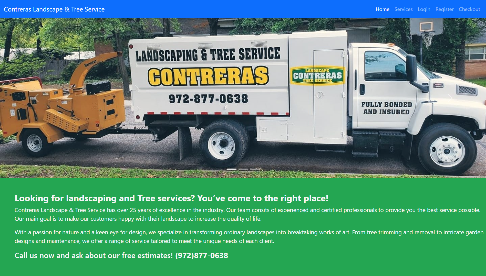
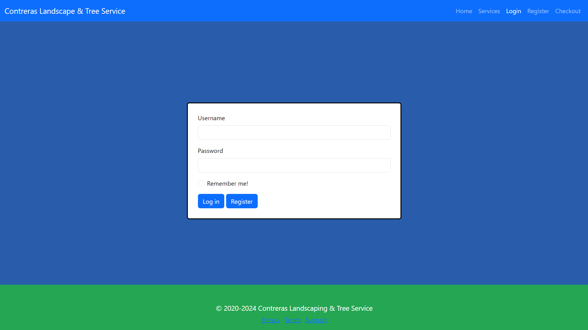
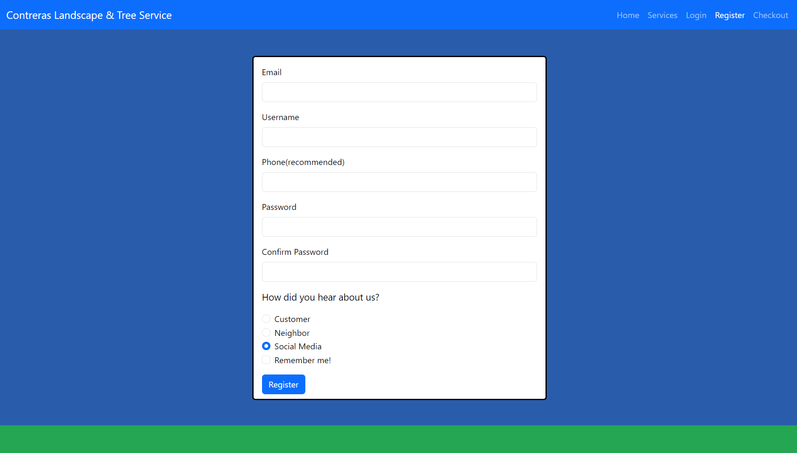
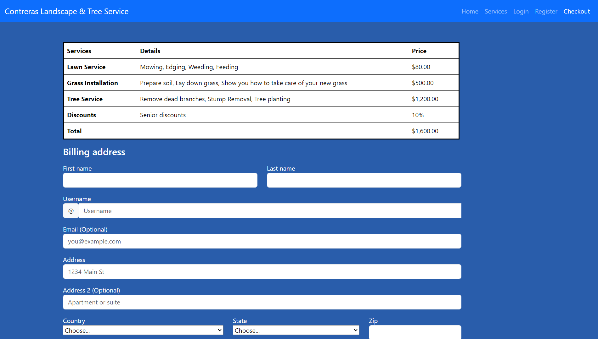
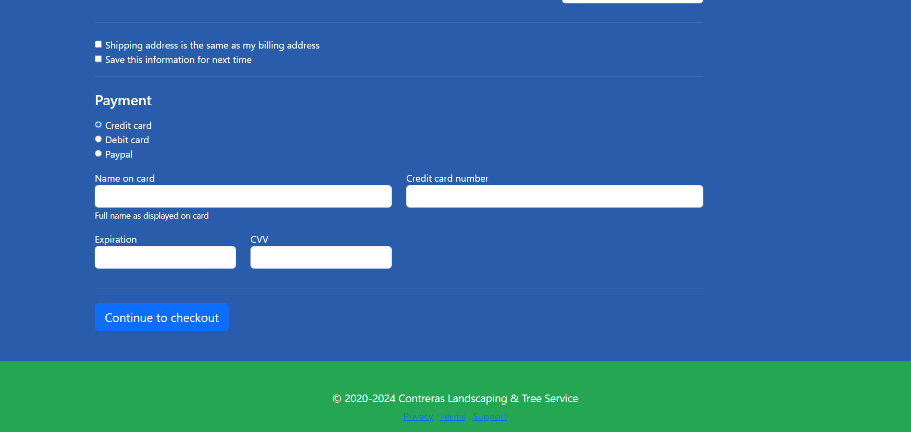

# contreras_landscape_capstone
Hello! This is my first website project which I developed with HTML, CSS, and Bootstrap. It contains 5 pages:
 
  1. index.html
  2. services.html
  3. login.html
  4. register.html
  5. checkout.html
     
and contains 1 CSS file:
  1. styles.css

## The technologies I used are:
* HTML
* CSS
* Bootstrap
* JavaScript


Screenshots of my 5 pages
--------------------------
Homepage



---
Service page


---
Login page


---
Register page


---
Checkout page



## Installation

1. Clone the repository: ```git clone [https://github.com/Practical-Seaweed/contreras_landscape_capstone.git]```
2. Navigate to the project directory ```cd contreras_landscape_capstone```

## One interesting piece of code I wrote

The carousel is one of them; I like how it can display multiple images or pieces of content like a slideshow. Even though it was difficult to code it the way I wanted, it turned out amazing for what I was trying to accomplish.
